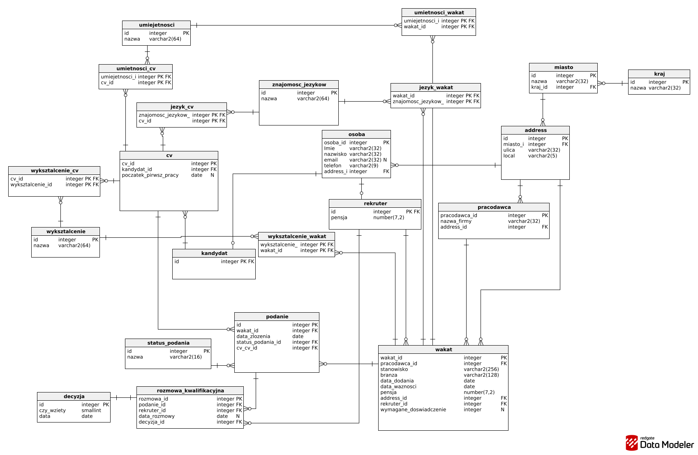

# System Zarządzania Rekrutacją i Dopasowania Kandydatów (HRMS)

Projekt relacyjnej bazy danych zrealizowany w technologii **Oracle SQL / PL/SQL**. System wspiera automatyzację procesów HR, zarządzanie etapami rekrutacji, analizę dopasowania aplikacji kandydatów do wymagań stanowisk oraz kontrolę spójności danych w terminarzach rozmów kwalifikacyjnych.

---

## Schemat Bazy Danych (ERD)

Architektura bazy danych została zaprojektowana zgodnie z zasadami **trzeciej formy normalnej (3NF)**, co eliminuje nadmiarowość danych i zapewnia ich pełną integralność. System efektywnie zarządza relacjami typu *Many-to-Many* (np. przypisanie umiejętności lub języków do CV oraz wakatów) poprzez tabele łączące.



---

## Logika Biznesowa i Automatyzacja (PL/SQL)

Repozytorium zawiera zaawansowane procedury oraz wyzwalacze, które automatyzują procesy rekrutacyjne bezpośrednio po stronie silnika bazy danych Oracle:

### 1. Automatyczne zamykanie wygasłych ofert (`Procedura p1`)
* **Opis:** Procedura identyfikuje wszystkie wakaty, których termin ważności już minął (`data_waznosci < SYSDATE`), wykorzystując jawny kursor (`wygasle_wakaty`).
* **Działanie:** Automatycznie aktualizuje status wszystkich powiązanych podań na wartość `Zakończone` (ID: 5). 
* **Bezpieczeństwo:** Posiada pełną obsługę transakcji (`COMMIT / ROLLBACK`) oraz blok `EXCEPTION` zarządzający zamykaniem kursora w przypadku wystąpienia nieoczekiwanego błędu.

### 2. Algorytm procentowego dopasowania skilli (`Procedura p2`)
* **Opis:** Zaawansowana procedura dopasowująca kandydata do wymagań konkretnego stanowiska.
* **Działanie:** Przechodzi przez aplikantów za pomocą kursora, zlicza wymagane umiejętności dla wakatu oraz umiejętności posiadane przez kandydata. Wylicza wynik punktowy według wzoru:
  $$\text{Score} = \left(\frac{\text{Dopasowane Umiejętności}}{\text{Wymagane Umiejętności}}\right) \times 100$$
* **Wynik:** Jeśli `Score` jest wyższy lub równy zdefiniowanemu progowi (`p_min_score`), status podania zostaje automatycznie zmieniony na `Weryfikacja` (ID: 2).

### 3. Walidacja danych wejściowych wakatów (`Wyzwalacz t1`)
* **Typ:** `BEFORE INSERT OR UPDATE ON wakat`
* **Działanie:** Chroni bazę przed niespójnymi danymi. Blokuje zatwierdzenie transakcji i zwraca błąd, jeśli użytkownik próbuje dodać wakat z datą z przyszłości (`data_dodania > SYSDATE`) lub gdy oferowana pensja jest mniejsza bądź równa zero (`pensja <= 0`).

### 4. Kontrola terminarza i kaskadowe czyszczenie (`Wyzwalacz t2`)
* **Typ:** `AFTER UPDATE OR DELETE ON podanie`
* **Działanie przy UPDATE:** Blokuje zmianę statusu podania na "Rozmowa kwalifikacyjna" (ID: 3), jeżeli rekruter nie przypisał jeszcze odpowiedniego terminu i osoby prowadzącej w tabeli `rozmowa_kwalifikacyjna`.
* **Działanie przy DELETE:** Automatycznie i bezpiecznie czyści powiązane rekordy rozmów w przypadku usunięcia aplikacji przez kandydata, dbając o integralność bazy.

---

## Przykładowe Zapytania Analityczne (DML)

W projekcie zaimplementowano różnorodne, zoptymalizowane zapytania SQL podzielone na kategorie:

* **Złączenia relacyjne (JOINs):** Pobieranie pełnych szczegółów o aktywnych wakatach (wraz z firmą, rekruterem i pełnym adresem: ulica, miasto, kraj) oraz generowanie pełnej historii rekrutacji z uwzględnieniem osób, które jeszcze nie odbyły rozmowy (`LEFT JOIN`).
* **Agregacja i filtrowanie (`GROUP BY` & `HAVING`):** Zliczanie liczby podań oraz wyliczanie średniej pensji w podziale na branże, z odrzuceniem sektorów zarabiających poniżej określonego progu.
* **Podzapytania skorelowane (`EXISTS`):** Identyfikacja rekruterów, którzy skutecznie zakończyli procesy rekrutacyjne i zatrudnili pracowników w 2026 roku.
* **Zaawansowane operacje masowe (`UPDATE` & `DELETE`):** Dynamiczne podnoszenie pensji o 10% dla wybranych firm na podstawie popularności ofert oraz usuwanie nieużywanych rekordów z tabel łączących.

---

## Instrukcja Uruchomienia

Aby wdrożyć i przetestować bazę danych, należy uruchomić skrypty w następującej kolejności:

1. **`DDL.sql`** – Utworzenie struktury tabel oraz kluczy głównych i obcych.
2. **`DML.sql`** – Zasilenie słowników oraz tabel testowych gotowymi danymi.
3. **`PLsql.sql`** – Kompilacja procedur `p1`, `p2` oraz wyzwalaczy `t1`, `t2`.
4. **`SQL_queries.sql`** – Uruchomienie przygotowanych zapytań analitycznych.

### Przykład wywołania procedur w konsoli:
```sql
-- Uruchomienie automatycznego zamykania wygasłych ofert
EXEC p1();

-- Uruchomienie analizy dopasowania dla wakatu nr 1 z progiem min. 50% skilli
EXEC p2(1, 50);
